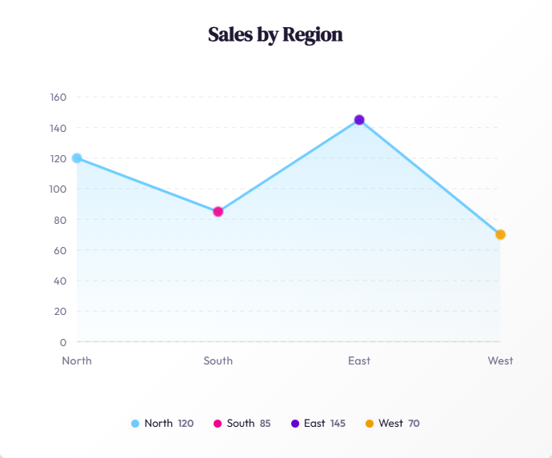
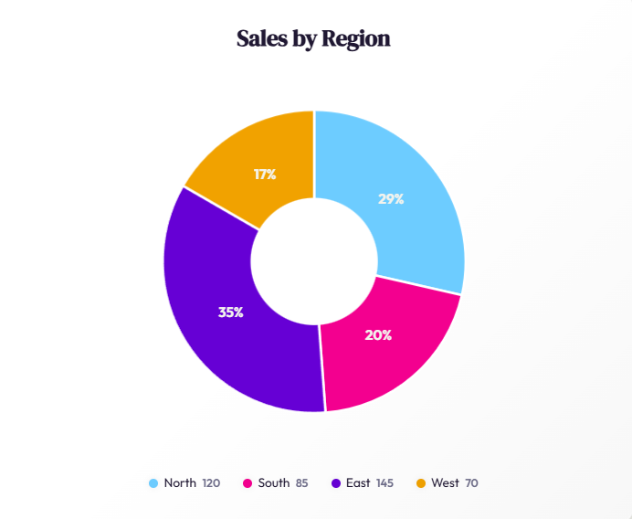
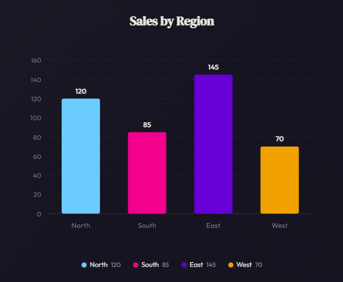

# 📊 DataPulse

A reusable, SVG-powered chart component built with **Angular 21** — no external chart libraries used. Supports **Line**, **Column**, and **Pie** charts rendered entirely with custom SVG logic.

---

## Live Demo

| | Link |
|---|---|
| 🚀 Deployed App | [faclon-custom-angular-charts.vercel.app](https://faclon-custom-angular-charts.vercel.app) |
| 💻 Source Code | [github.com/rahultapase/faclon-custom-angular-charts](https://github.com/rahultapase/faclon-custom-angular-charts) |

---

## Features

- **Three chart types** — Line (connected points with axes), Column (vertical bars), Pie (circular segments with donut hole)
- **Pure SVG rendering** — all charts drawn with computed SVG elements, no Canvas or third-party libraries
- **Reusable component** — single `<io-chart [chartOptions]="options" />` API driven by a typed configuration object
- **Responsive design** — SVG `viewBox` scaling + CSS media queries for mobile/desktop
- **Hover effects** — interactive tooltips on data points, bars, and pie slices with smooth transitions
- **Legend** — auto-generated color-coded legend with name and value display
- **Animations** — CSS keyframe animations for line drawing, bar growth, pie reveal, tooltip appearance, and chart-swap transitions
- **Edge-case handling** — empty series, zero values, single-item pie, negative values (clamped to 0)
- **OnPush change detection** — all components use `ChangeDetectionStrategy.OnPush` for optimal performance
- **Angular Signals** — modern reactive state with `signal()`, `computed()`, and `input.required()`

---

## Screenshots

### Light Mode

| Line Chart | Column Chart | Pie Chart |
|---|---|---|
|  |  |  |

### Dark Mode

| Line Chart | Column Chart | Pie Chart |
|---|---|---|
|  |  |  |

---

## Usage

### Component API

```html
<io-chart [chartOptions]="options" />
```

### ChartOptions Interface

```typescript
interface ChartOptions {
  type: 'line' | 'column' | 'pie';
  title: string;
  series: {
    name: string;
    value: number;
    color: string;
  }[];
}
```

### Example

```typescript
chartOptions: ChartOptions = {
  type: 'line',
  title: 'Sales Report',
  series: [
    { name: 'Offline', value: 30, color: 'red' },
    { name: 'Online', value: 70, color: 'blue' }
  ]
};
```

```html
<io-chart [chartOptions]="chartOptions" />
```

---

## Project Structure

```
src/
 └── app/
      ├── app.ts                          # Root component with demo data & chart switcher
      ├── app.html                        # App shell template
      ├── app.scss                        # App-level styles
      └── chart/
           ├── chart.ts                   # Main <io-chart> component (orchestrator)
           ├── chart.html                 # Template with @switch for chart types
           ├── chart.scss                 # Card wrapper styles
           ├── models/
           │    └── chart.models.ts       # TypeScript interfaces (ChartOptions, SeriesItem, etc.)
           ├── utils/
           │    └── chart-math.utils.ts   # Pure math functions (axis ticks, bar/point/slice computation)
           └── components/
                ├── chart-line/           # SVG line chart with area fill & animated points
                ├── chart-column/         # SVG column chart with animated bars & value labels
                ├── chart-pie/            # SVG pie/donut chart with hover-explode effect
                ├── chart-legend/         # Color-coded legend strip
                └── chart-tooltip/        # Fixed-position hover tooltip
```

---

## Approach & Architecture

### Component Design
The `<io-chart>` component acts as an **orchestrator** — it receives a `ChartOptions` input and delegates rendering to the appropriate sub-component (`chart-line`, `chart-column`, or `chart-pie`) using Angular's `@switch` control flow. This keeps each chart type self-contained and testable.

### SVG Rendering
All charts are rendered as SVG elements with computed attributes. The `chart-math.utils.ts` module contains pure functions for:
- **Y-axis tick computation** — produces "nice" round numbers for grid lines
- **Line point mapping** — converts data values to SVG coordinates
- **Column bar geometry** — calculates bar positions, widths, and heights
- **Pie slice arcs** — generates SVG path strings using polar-to-cartesian conversion

### State Management
Uses **Angular Signals** (`signal()`, `computed()`, `input.required()`) for reactive state. No RxJS subscriptions needed — the component tree re-renders efficiently via `OnPush` change detection.

### Animations
- **Line chart**: stroke-dashoffset animation draws the line, followed by point fade-ins
- **Column chart**: bars grow upward with spring easing (`cubic-bezier`)
- **Pie chart**: scale + rotate entrance, individual slice fade-ins
- **Chart swap**: Angular `@trigger` animation with cross-fade between chart types

---

## Getting Started

### Prerequisites
- Node.js 18+
- Angular CLI 21+

### Install & Run

```bash
# Install dependencies
npm install

# Start dev server
ng serve
```

Open `http://localhost:4200/` in your browser.

### Build

```bash
ng build
```

Build artifacts are output to the `dist/` directory.
